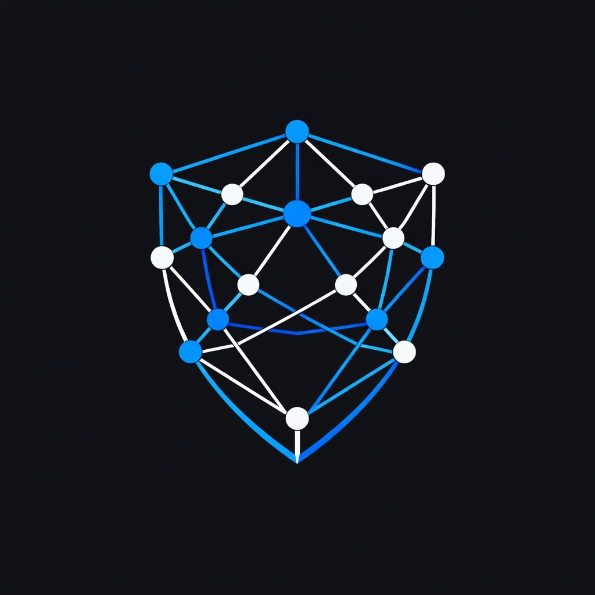
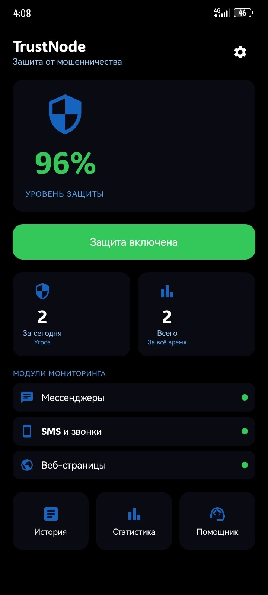
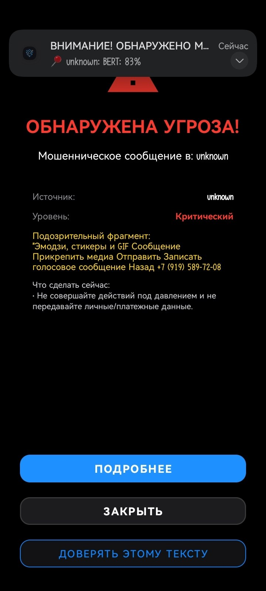
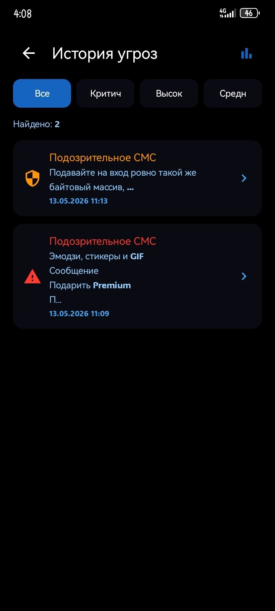
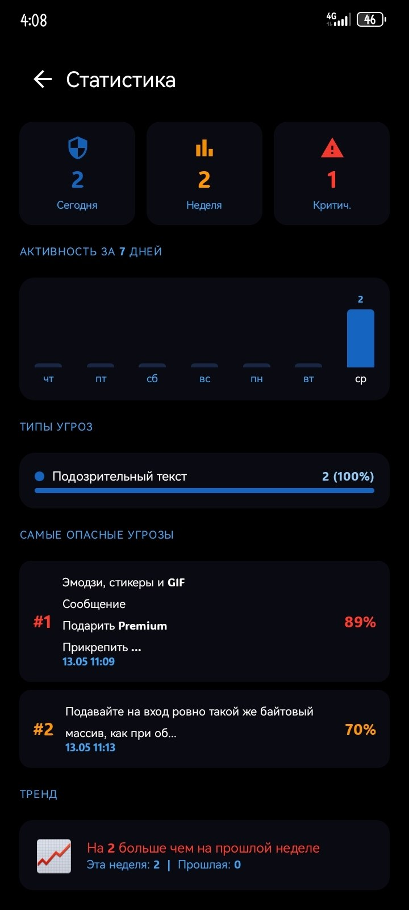
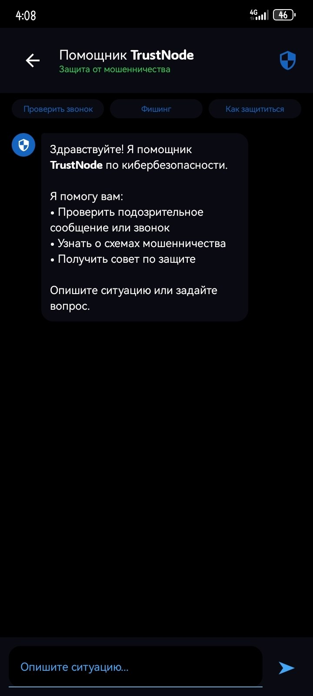
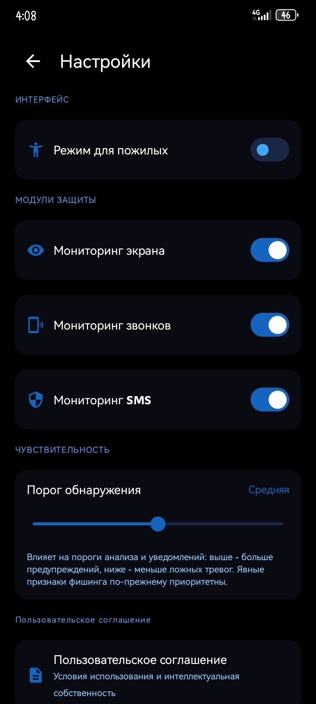

# TrustNode

### AI-система защиты от мошенничества и социальной инженерии

**Победитель регионального этапа НИР 2026 · Квалификация на федеральный конкурс (Москва, сентябрь 2026)**

---

## О проекте

TrustNode — мобильная система защиты от мошенничества и социальной инженерии с локальным AI-детектором. Анализирует звонки и сообщения в реальном времени **прямо на устройстве** — без передачи данных на сторонние серверы.

Приложение ориентировано в первую очередь на защиту уязвимых групп пользователей: пожилых людей, детей и всех, кто сталкивается с телефонными мошенниками и фишингом.

## Скриншоты

| Главный экран | Обнаружена угроза | История угроз |
|:---:|:---:|:---:|
|  |  |  |

| Статистика | Помощник | Настройки |
|:---:|:---:|:---:|
|  |  |  |

## Возможности

- 📞 **Защита звонков** — определение мошеннического сценария по транскрипции разговора
- 💬 **Мессенджеры** — мониторинг сообщений через AccessibilityService
- 🔗 **Проверка ссылок** — фишинговые домены, вредоносные URL
- 🛡️ **VPN-режим** — защита соединения через шифрованный туннель
- 🤖 **AI-помощник** — объяснение угроз, советы по защите
- 📊 **Статистика** — история угроз, графики активности
- 👴 **Режим для пожилых** — упрощённый интерфейс, крупный шрифт
- 🔒 **Полностью офлайн** — AI работает локально, интернет не нужен

## Принципы приватности

- 100% обработка данных на устройстве
- Личные данные не передаются на внешние серверы без явного согласия пользователя
- Прозрачный журнал всех обращений к данным
- Шифрование чувствительных данных в хранилище
- Соответствие Федеральному закону № 152-ФЗ «О персональных данных»

## Минимальные требования

**Android 7.0 (API 24) · 2 GB RAM · 150 MB свободного места**

## Награды и признание

- 🥇 **1 место** — региональный этап НИР, секция «Информационные технологии», 2026
- 🏛️ **Федеральный конкурс** — квалификация, Москва, сентябрь 2026
- 📋 **Патент** — заявка подана в ФИПС (Роспатент), МПК G06F 21/55

## Автор

**Михаил Питолин**  
Студент ГБПОУ ЧРТ · Специальность 10.02.05 «Обеспечение информационной безопасности»  
Челябинск, 2025–2026

## Юридические документы

- [Политика конфиденциальности (RU)](legal/privacy_policy_ru.txt)
- [Политика конфиденциальности (EN)](legal/privacy_policy_en.txt)
- [Пользовательское соглашение (RU)](legal/terms_ru.txt)
- [Пользовательское соглашение (EN)](legal/terms_en.txt)
- [Уведомление оператора ПДн (152-ФЗ)](NOTIFICATION_RKN_152FZ.txt)

---

*Данный репозиторий — публичная витрина проекта. Исходный код и алгоритмы не публикуются и защищены патентным правом РФ.*

